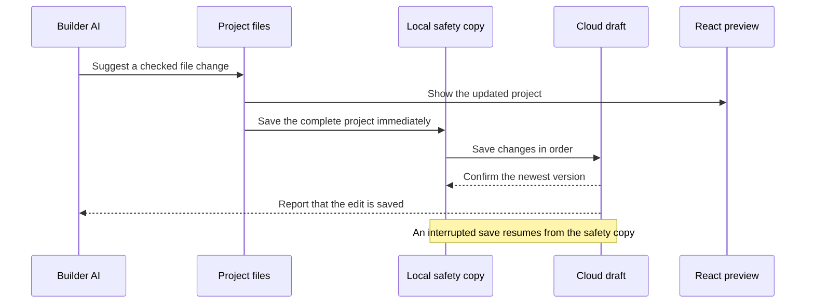

# Unison Tasks

**Unison helps turn a business idea into a working React website and a lasting Business workspace.** A guided launch flow learns about the business, its industry, the pages it needs, the actions visitors should be able to take, and the visual style it should use. Unison then carries that same project through AI editing, hands-on editing, preview, recovery, setup, and publishing.

The important part is continuity: Unison does not treat a launch or an AI edit as a one-time response. The project remains connected to its source files, business workspace, saved history, and live preview throughout its life.

## What Unison Does

- The **System Launcher** gathers the business goals, industry, page choices, visitor actions, and preferred style.
- Unison creates one complete React/TypeScript project instead of a collection of disconnected page mockups.
- The selected industry remains part of the site's real design identity; changing the style does not quietly turn it into a generic template.
- A confirmed launch creates the site, project, editable draft, build record, and workspace connections together.
- Builder AI receives clear information about the page, section, desired outcome, and allowed actions before it makes a change.
- The Web Builder, AI tools, preview, recovery system, and publishing flow all work from the same project files.
- Every accepted AI edit is saved locally for recovery and then saved to the Cloud before Unison reports success.
- Cloud projects stay inside the correct business workspace and reopen with their latest source-backed draft.
- Visitor actions such as booking, lead capture, checkout, and navigation come from an approved list of behaviors.
- The preview runs the real React project in Sandpack, so a broken build is shown as a real error rather than replaced with a placeholder page.

## How a Site Comes Together

```mermaid
flowchart LR
    A[Choose the business, pages, and style] --> B[Plan the site and create its React files]
    B --> C[Connect pages to approved visitor actions]
    C --> D[AI writes the page content and components]
    D --> E[Check that the React project works]
    E --> F[Save the complete launch together]
    F --> G[Open the project in its Cloud workspace]
    G --> H[Edit, preview, finish setup, and publish]
```



1. The launcher combines the chosen industry, page layout, theme, and visitor actions.
2. Unison creates the page plan, navigation, runtime rules, and complete set of project files.
3. Builder AI fills in the registered pages while following that plan. If generation fails, Unison reports the problem instead of showing a generic fallback site.
4. When the user confirms the launch, the backend checks the files and saves the business, site, project, draft, build, and bundle as one operation.
5. The Web Builder opens the saved source and uses it for editing, previewing, recovery, and publishing.
6. Setup tasks and publishing checks continue from the same confirmed site instead of trying to guess which project they belong to later.

Style choices travel with the project. Unison saves the selected colors as reusable theme values, builds the shared stylesheet from those values, and prevents AI output from silently replacing them with unrelated hardcoded colors. The original style selection is kept for reference, but the saved theme values are what determine the site's appearance.

The site plan is also created once and shared across launch, persistence, the Web Builder, and publishing. This keeps page identities, navigation, visitor actions, and saved source aligned from beginning to end.

## How Unison Keeps Projects Consistent

Every project has three separate parts:

| Project part                      | What it decides                                                     | What it leaves alone               |
| --------------------------------- | ------------------------------------------------------------------- | ---------------------------------- |
| Business plan (`SystemBlueprint`) | Business type, goals, pages, workflows, and allowed visitor actions | Page layout and visual styling     |
| Page layout (`TemplateStructure`) | Section order, navigation, composition, and content density         | Business behavior and theme colors |
| Visual style (`ThemeSkin`)        | Color, typography, spacing, shape, and motion                       | Page structure and visitor actions |

They come together in this order:

```text
page layout -> visitor actions -> visual style -> complete project -> AI-authored pages
```

This separation lets someone change the look of a site without losing its pages, business purpose, or working actions.

## What You Can Rely On

| Promise                 | What it means                                                                                                          |
| ----------------------- | ---------------------------------------------------------------------------------------------------------------------- |
| One saved source        | The full project file set is the main saved version. Older single-file fields are used only to reopen legacy projects. |
| Stable project identity | A draft remains linked to its Cloud project and, after confirmation, to its site.                                      |
| Complete launches       | Unison creates and connects the business, site, project, draft, build, and bundle before opening the builder.          |
| React-only preview      | The active Web Builder uses the React/Sandpack preview. It does not switch to Docker or a local Vite fallback.         |
| Safe AI changes         | AI file paths are cleaned up, checked, previewed, applied, journaled for recovery, and saved before success is shown.  |
| Interruption recovery   | Pending full-project edits can survive a refresh, navigation, a closed tab, or an interrupted process.                 |
| Newer saves win         | Draft saves run in order, so an older slow request cannot overwrite a newer edit.                                      |
| Live edits stay visible | Recently accepted source changes remain authoritative while the durable site snapshot catches up.                      |
| Useful history          | Accepted commits may be added to site revision history while autosave continues to hold the current working draft.     |
| Workspace privacy       | Business, site, setup, form, and revision data stay behind membership-based access rules.                              |

For maintainers, the complete saved source lives in `builder_drafts.vfs_files`, and `builder_drafts.project_id` is the direct draft-to-project relationship. Confirmed launches also save `site_id`. The older `editor_code` and `code` fields remain available only for backward compatibility.

## AI Edits Are Saved Safely



Before an AI request is sent, Unison describes what is being changed: the route, page or section, intended outcome, allowed actions, important constraints, related files, required confirmations, and the order of work. This gives the model enough context to make a focused edit instead of guessing about the whole project.

AI responses are handled as structured file changes. Unison can recover the file data when a model wraps it in explanatory text, translate preview-friendly paths into the project's real `/src/...` paths, and correctly apply stylesheet-only changes to `/src/index.css`. A whole-site restyle may update shared theme values and several components, while a targeted request stays limited to its intended area.

As soon as an edit is accepted, `builderStateRecovery.ts` records a versioned copy of the full project before the Cloud request begins. Cloud writes are queued in order and confirmed against the exact saved version. If the session ends before the latest write finishes, the pending copy is replayed the next time the project opens. This also covers a project's first save and anonymous work before it receives its permanent draft ID.

## Previewing the Site

The Web Builder has one active preview: `VFSPreview`. It runs the same React files that the editor and AI tools change, using the self-hosted Sandpack runtime. Normal source edits update the preview without a full restart. If project dependencies change, Sandpack reloads cleanly. While a new version is compiling, the last working preview remains visible instead of flashing an empty frame.

The preview runner comes from the Unison application itself:

- During local development, Vite serves the runner for preview frames opened by the Web Builder.
- In production, the build includes the Sandpack runtime under `dist/sandpack`, and Vercel routes preview requests to it.
- **Open preview** creates a browser-scoped external session that lasts for 24 hours and uses the same React runtime.

Older Docker and local-preview helpers remain in the repository for historical tooling, but the active Web Builder does not use them as fallbacks.

## What a Confirmed Launch Creates

A confirmed launch is saved as one connected unit. Unison checks the user's access, file paths, file count, and payload size before writing anything. It then creates or links:

- the business, site, Cloud project, and editable source draft;
- the completed build, site bundle, and current runtime settings;
- enabled business features and a site-specific setup checklist;
- working form definitions and tenant-scoped CRM submissions;
- framework version information so older projects can be upgraded and reopened safely;
- attribution and export rules that stay with exported source projects;
- a usage event for the completed launch.

If any required part fails, the transaction rolls back so the user is not left with a half-created project.

For maintainers, this work is handled by the authenticated `provision-launch-site` Edge Function. The supporting records include `site_runtime_configs`, `site_capabilities`, `site_setup_steps`, and `form_definitions`, along with the source-backed draft, build, and bundle.

## The Main Parts of the Platform

| Area                | Role in Unison                                                                                                      |
| ------------------- | ------------------------------------------------------------------------------------------------------------------- |
| Application         | React 19, TypeScript 5.9, Vite 7, and React Router 7 power the main product.                                        |
| Interface and state | Tailwind, Radix UI, TanStack Query, and React Context support the editing experience.                               |
| Web Builder         | Monaco, CodeMirror, Fabric, and a shared virtual file system provide code and visual editing.                       |
| Preview             | Sandpack runs the real React project from an application-hosted, same-origin runner.                                |
| Cloud backend       | Supabase provides sign-in, Postgres data, row-level access rules, live updates, and Edge Functions.                 |
| Saving and recovery | Full source drafts, the interruption journal, the component graph, and site revisions preserve project state.       |
| AI                  | Structured task context and the authenticated `ai-code-assistant` function turn requests into checked file changes. |
| Site runtime        | Site identity, builds, bundles, capabilities, setup steps, forms, and runtime settings support the finished site.   |
| Automation          | Inngest events and workflow endpoints connect business actions to background work.                                  |
| Deployment          | Vercel hosts the application and preview assets; Supabase hosts data and Edge Functions.                            |

### The Source Files Are the Project

The deliverable is a complete React/TSX file system, not a block of generated HTML or a result that exists only in memory. Each project includes source under `/src`, public assets, project configuration, and Unison metadata under `/.unison`.

The builder, AI tools, preview, recovery flow, and publishing pipeline all share these files. If a launch or edit cannot produce valid, renderable source, Unison surfaces the error instead of disguising it with a generic placeholder.

### Visitor Actions Stay Predictable

Unison uses a closed catalog of business actions. During the build, approved actions are connected to the relevant buttons, forms, and links. At runtime, those connections resolve to known handlers. A template cannot invent an unreviewed action of its own.

### How Cloud Recovery Works

Cloud project cards combine the project record with its latest source-backed draft and stay scoped to the active business workspace. They refresh when project events occur, when the browser regains focus, and through Supabase Realtime.

When a project reopens, Unison uses this order:

1. A pending local safety copy wins if the latest Cloud save was interrupted.
2. The full saved Cloud file set is the normal resume point.
3. Older single-file draft fields can reopen legacy projects.
4. Known historical file layouts are upgraded once and record the migration version that was applied.
5. Very old metadata-only projects remain clearly identified instead of receiving a made-up preview.

The related Cloud records include `businesses`, `sites`, `projects`, `builder_drafts`, site builds and bundles, and project revisions.

## Repository Guide

```text
src/
  components/onboarding/   System Launcher and launch controls
  components/creatives/    Web Builder surfaces
  components/cloud/        Cloud workspace and project recovery UI
  builder/controllers/     Builder session, topology, and Playground controllers
  platform/core/           Site planning, industry rules, actions, and launch pipeline
  unison/                  AI task planning and context
  services/                Files, launch, recovery, preview, saving, and publishing
  contexts/                Launch and shared project-file state

supabase/
  functions/               Server-side AI, public runtime, and launch functions
  migrations/              Database schema and row-level access rules

api/                       Vercel API and Inngest endpoints
docs/                      Architecture, setup, operations, and integration guides
scripts/                   Local setup, deployment, and infrastructure helpers
```

## Running Locally

### What You Need

- Node.js `>=20 <23`
- npm or Bun
- A Supabase project for sign-in, saved projects, and Edge Functions
- The Supabase CLI when running the backend locally, applying database changes, or deploying functions

### Install and Start

```bash
git clone https://github.com/Invictusprime7/unison-tasks-official.git
cd unison-tasks-official
npm install

# Copy the public browser configuration template, then add your own values.
cp .env.example .env.local

npm run dev
```

Vite prints the local address after startup. For everyday frontend work, the application can use a configured remote Supabase project. Run the local Supabase stack only when the work calls for local backend or infrastructure changes.

### Environment Settings

Use [`.env.example`](.env.example) as the reference. The browser needs only the public Supabase settings:

| Variable                        | Purpose                                         |
| ------------------------------- | ----------------------------------------------- |
| `VITE_SUPABASE_URL`             | Supabase project URL                            |
| `VITE_SUPABASE_PUBLISHABLE_KEY` | Browser-safe Supabase publishable/anonymous key |

Keep privileged credentials on the server. Add `OPENAI_API_KEY`, `GEMINI_API_KEY`, `ANTHROPIC_API_KEY`, and `SUPABASE_SERVICE_ROLE_KEY` as Supabase Edge Function secrets or equivalent server-only environment variables. Never expose them with a `VITE_` prefix.

### Optional Local Supabase Stack

```bash
npx supabase start
npx supabase db push
```

The React preview does not need a separate preview service. Vite serves the same-origin Sandpack runner during development, and the production build copies the runner assets automatically.

## Useful Commands

```bash
# Check the application
npx vitest run
npm run lint
npm run type-check
npm run build
npm run lint:pipeline-bypass
npm run lint:single-source-of-truth
npm run lint:catalog-contracts

# Run the application and React preview
npm run dev
npm run preview

# Work on automations
npm run inngest:dev
npm run automation:dev

# Deploy
npm run deploy             # Vercel production deployment
npm run deploy:preview     # Vercel preview deployment
npx supabase db push --linked --dry-run
npx supabase functions deploy
```

## Project Principles

- **Build real React projects.** Unison creates source-backed React/TSX projects, not HTML-only mockups.
- **Keep one shared project source.** The editor, AI actions, autosave, recovery, and preview all work on the same files.
- **Use one React preview.** Sandpack owns the active Web Builder preview; Docker and local Vite are not runtime fallbacks.
- **Save before reporting success.** AI edits receive a local recovery copy and an ordered Cloud save before Unison says they are complete.
- **Save before moving on.** Launcher-generated source and confirmed site identity are stored before the user enters the builder.
- **Protect the newest work.** An older response or save confirmation cannot replace a more recent project version.
- **Respect accepted edits.** Generated snapshots describe the site plan, while newer source edits remain visible until the snapshot includes them.
- **Show generation failures honestly.** The launcher does not hide an AI failure behind a generic site.
- **Protect private operations.** Builder and launch changes require authentication; public runtimes validate the site, allowed inputs, and abuse limits.
- **Keep secrets off the client.** Provider keys and service-role credentials stay in server-side settings.

## Where to Look in the Code

| If you are working on...                 | Start here                                                                      |
| ---------------------------------------- | ------------------------------------------------------------------------------- |
| System launch and confirmed handoff      | [`SystemLauncher.tsx`](src/components/onboarding/SystemLauncher.tsx)            |
| Site planning and snapshot creation      | [`canonicalPipeline.ts`](src/platform/core/canonicalPipeline.ts)                |
| Web Builder coordination and autosave    | [`WebBuilder.tsx`](src/components/creatives/WebBuilder.tsx)                     |
| AI task planning and edit controls       | [`AIBuilderPanel.tsx`](src/components/creatives/web-builder/AIBuilderPanel.tsx) |
| Structured AI context                    | [`aiContext.ts`](src/unison/aiContext.ts)                                       |
| Reading structured AI responses          | [`aiResponseParser.ts`](src/utils/aiResponseParser.ts)                          |
| Turning AI output into project files     | [`aiVFSOrchestrator.ts`](src/services/aiVFSOrchestrator.ts)                     |
| Interruption recovery                    | [`builderStateRecovery.ts`](src/services/builderStateRecovery.ts)               |
| Keeping snapshots and live edits aligned | [`snapshotProjector.ts`](src/services/snapshotProjector.ts)                     |
| React/Sandpack preview                   | [`VFSPreview.tsx`](src/components/VFSPreview.tsx)                               |
| External preview sessions                | [`externalPreviewSession.ts`](src/services/externalPreviewSession.ts)           |
| Cloud project and draft merging          | [`cloudProjectDrafts.ts`](src/services/cloudProjectDrafts.ts)                   |
| Confirmed launch requests                | [`confirmedLaunchProvisioner.ts`](src/services/confirmedLaunchProvisioner.ts)   |
| Confirmed launch transaction             | [`provision-launch-site`](supabase/functions/provision-launch-site/index.ts)    |
| Site setup checklist                     | [`siteSetupPlan.ts`](src/services/siteSetupPlan.ts)                             |
| Upgrading historical projects            | [`frameworkVfsMigration.ts`](src/services/frameworkVfsMigration.ts)             |
| Source export attribution                | [`unisonAttribution.ts`](src/services/export/unisonAttribution.ts)              |

## More Documentation

| Guide                                                              | What it covers                                          |
| ------------------------------------------------------------------ | ------------------------------------------------------- |
| [Architecture](docs/ARCHITECTURE.md)                               | Detailed and historical system architecture             |
| [AI setup](docs/AI_SETUP_GUIDE.md)                                 | AI provider and key setup                               |
| [AI template troubleshooting](docs/AI_TEMPLATE_TROUBLESHOOTING.md) | Finding and repairing generation problems               |
| [Build to canvas workflow](docs/BUILD_TO_CANVAS_WORKFLOW.md)       | How the builder and preview work together               |
| [Preview runtime](docs/PREVIEW_RUNTIME_ARCHITECTURE.md)            | Sandpack preview pipeline and runtime operations |
| [VFS preview](docs/VFS_PREVIEW_ARCHITECTURE.md)                    | Project files and Sandpack integration                  |
| [Universal intent system](docs/UNIVERSAL_INTENT_SYSTEM.md)         | Approved visitor actions and their runtime behavior     |
| [Automation recipes](docs/AUTOMATION_RECIPES_ENGINE.md)            | Workflow recipe engine                                  |
| [CRM pipeline automation](docs/CRM_PIPELINE_AUTOMATION.md)         | CRM workflows and pipeline automation                   |
| [Inngest CRM setup](docs/INNGEST_CRM_SETUP.md)                     | Inngest and CRM integration                             |
| [Stripe setup](docs/STRIPE_SETUP.md)                               | Payment configuration                                   |
| [CRM schema reference](docs/CRM_SCHEMA_DEPLOYMENT.sql)             | CRM database schema reference                           |
| [Vercel environment setup](docs/vercel-env-setup.md)               | Production environment configuration                    |

## Security

Supabase row-level rules keep workspace, site, setup, form, and revision data limited to the right business and project members. Private builder and launch changes go through authenticated Edge Functions that check inputs, payload sizes, and allowed origins.

Public forms use the intentionally public `form-submit` runtime. It checks the site and intended action, limits payloads, rejects duplicate or suspicious submissions, applies rate limits, and prevents browsers from writing directly to CRM tables.

Keep deployment credentials, `SUPABASE_SERVICE_ROLE_KEY`, `SUPABASE_DB_URL`, and AI provider keys out of the browser bundle. Run the validation commands above before deploying changes.

## License

This project is licensed under the [MIT License](LICENSE).
